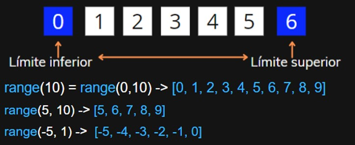

Imagina que tienes una caja con bloques numerados y quieres hacer algo con cada bloque, como pintarlo. En lugar de sacar cada bloque y pintarlo uno por uno, manualmente y recordando cuál fue el último que pintaste, puedes usar un proceso que automáticamente tome cada bloque, lo pinte y pase al siguiente. En programación, cuando queremos hacer una operación repetitiva como está, usamos algo llamado un "bucle", y el bucle for es uno de los tipos más comunes.

# ¿Qué es un Bucle?
Un bucle es una construcción que repite un bloque de código. Imagina que tienes que recitar los números del 1 al 10; en lugar de escribir o decir cada número individualmente, podrías simplemente decir "empiezo en 1 y continúo hasta 10". Esto es lo que hace un bucle: ejecuta un proceso de repetición. For también es un tipo de bucle.

# ¿Qué es un Bucle for?

Un bucle for es una instrucción en Python que te permite ejecutar un bloque de código varias veces, es decir, de forma repetitiva. Es como decirle a la computadora: "Para cada elemento en esta colección de elementos, haz esto".

## ¿Cómo funciona?
Aquí está la estructura básica de un bucle for en Python:

```python
for variable in secuencia:
    # Instrucciones a repetir
```
- `for:` Es la palabra clave que indica el inicio del bucle.
- `variable`: Es un nombre que le das a cada elemento de la secuencia mientras lo estás revisando.
- `secuencia`: Es una colección de elementos que quieres recorrer. Puede ser una lista de números, caracteres en una cadena de texto, o cualquier otra `secuencia`.

## ¿Qué hace realmente?
La sentencia toma la secuencia y, uno por uno, coloca cada elemento en la variable y luego ejecuta el bloque de instrucciones que has escrito debajo de ella. Una vez que el bloque de código se ha ejecutado para un elemento, el bucle for procede al siguiente elemento de la secuencia y repite el proceso hasta que todos los elementos han sido procesados.

## Un ejemplo simple
Digamos que tienes una secuencia de números (0, 1, 2) y quieres imprimir cada número en la pantalla. Usarías un bucle for de la siguiente manera:

```python
for numero in range(3):
    print(numero)
```

Esto imprimirá:

0

1

2

# ¿Qué es range y cómo se relaciona con for?
`range()` es una función incorporada en Python que genera una secuencia de números. Es muy útil cuando sabes cuántas veces quieres ejecutar un bucle. Por ejemplo, `range(3)` genera una secuencia de números de 0 a 2.
Cuando usas range con un bucle `for`, estás diciendo: "Quiero que repitas estas instrucciones para cada número que range produce".

## Funcionamiento básico de range
La función range puede ser llamada de diferentes maneras dependiendo de cuántos argumentos le pases:
- `range(stop)`: Genera números desde 0 hasta stop - 1.
- `range(start, stop)`: Genera números desde start hasta stop - 1.
- `range(start, stop, step)`: Genera números desde start hasta stop - 1, incrementando cada número por step.



**Ejercicio:** Piensa un poco sobre que se va a imprimir con los siguientes código y después pruébalos en el compilador:
```python
for i in range(-5):
    print(i)
```
```python
for i in range(-5, 0):
    print(i)
```
```python
for i in range(5, 0):
    print(i)
```
```python
for i in range(5, -1, -1):
    print(i)
```

## Ejemplos de range en acción
- `range(3)`: Genera 0, 1, 2.
- `range(1, 4)`: Genera 1, 2, 3.
- r`ange(0, -5, -1)`: Genera 0, -1, -2, -3, -4.
range(5, 1, -2): Genera 5, 3.

# En resumen
- `range` genera números dentro de un rango definido.
- Si el primer número es mayor que el segundo y no hay un `'step'` negativo, la secuencia es vacía.
- Los números negativos son válidos como 'start' o 'stop'.
- Un `'step'` negativo permite que range cuente hacia atrás.

Cada vez que range se utiliza en un bucle for, permite al bucle iterar sobre la secuencia de números que range genera. Esto te da el control sobre la cantidad de iteraciones y sobre qué valores toma la variable de iteración en cada paso del bucle.
