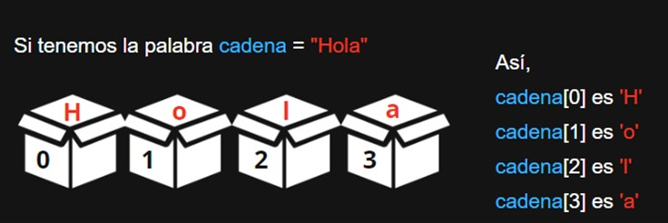

Hasta ahora has aprendido qué son las variables, cómo se leen, qué tipos hay, etc. 

Pero ¿hay forma de guardar varios datos y no solo uno? Por ejemplo, si quiero guardar los 5 nombres de mis mejores amigos, ¿tengo que declarar 5 variables de tipo String (amigo1, amigo2, amigo3, amigo4, amigo5)? La respuesta es no, en programación contamos con una estructura de datos llamada arreglo, que nos ayuda a guardar muchos datos de un mismo tipo en un “mismo lugar” y de forma ordenada, así que no necesitas 5 variables o 10 o 100 si lo que quieres es guardar 5, 10 o 100 datos.

Los arreglos almacenan datos de forma ordenada, para que puedas acceder a ellos de una manera más sencilla. Piénsalo como una serie de cajitas numeradas del 0 al n-1, si lo que quieres es guardar 5 datos, el primero se encontrará en la cajita 0 y el último en la cajita número 4.

# Cómo declarar un arreglo:
```python
mi_arreglo = [elemento1, elemento2, elemento3]
```
También puedes declarar un arreglo vacío y agregar elementos después:
```python
mi_lista_vacia = []
mi_lista_vacia.append(1)
mi_lista_vacia.append(2)
mi_lista_vacia.append(3)
```
# Índices de un arreglo

Los índices en un arreglo son una manera de acceder a los elementos individuales almacenados en el arreglo. En la mayoría de los lenguajes de programación, incluyendo Python, los arreglos tienen índices basados en cero. Esto significa que el primer elemento del arreglo está en el índice 0, el segundo en el índice 1, y así sucesivamente hasta el último elemento, que está en el índice que es uno menos que el tamaño total del arreglo.

Para acceder a un elemento, usamos el nombre del arreglo seguido de corchetes que contienen el índice del elemento que queremos. Por ejemplo, `arr[0]` accedería al primer elemento, `arr[1]` al segundo, y `arr[n-1]` al último elemento de un arreglo `arr` de tamaño `n`.

Cuando queremos trabajar con cada elemento de un arreglo, podemos usar un bucle `for` para iterar a través del arreglo usando su índice. Esto nos permite realizar operaciones con cada elemento del arreglo. Por ejemplo:

```python
arr = [10, 20, 30, 40, 50]

for i in range(len(arr)):
    print("El valor en el índice",i,"es",arr[i])
```

En este ejemplo, `range(len(arr))` crea una secuencia de números que va desde 0 hasta el tamaño del arreglo menos uno. El bucle `for` se ejecuta una vez para cada número en esa secuencia, asignando a `i` el valor actual del índice. Dentro del bucle, `arr[i]` accede al elemento del arreglo que está en la posición `i`, y luego se imprime ese elemento junto con su índice.

También podemos tratar a las cadenas como un arreglo. Por ejemplo: la cadena “Hola” es como un arreglo, en el cual “H” está en la posición 0, “o” en 1, “l” en 2 y “a” en la posición 3.  


Recordar
Los string se declaran así:
```python
cadena1 = "" # cadena vacía
cadena2 = "Hola" #cadena que guarda hola
```
# Funciones importantes

La función `len()` devuelve la longitud de una cadena de caracteres. 

**Ejemplo:**
```python
len("Coding Rush")  #es 11
```
Se pueden concatenar arreglos con el operador + 

**Ejemplo:**
```python
cadena1 = "Coding "
cadena2 = "Rush"
print(cadena1 + cadena2)
```
La salida es:

Coding Rush

La función `str()` toma un objeto y lo vuelve un string. 

**Ejemplo:**
```python
numero1 = 20
cadena1 = str(numero1)
cadena2 = str(3.1416)
```
Aquí `cadena1 `es "20" y `cadena2` es "3.1416"