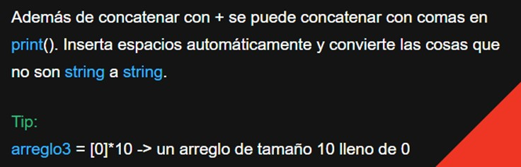

# Código ASCII

**El código ASCII** (American Standard Code for Information Interchange) es un conjunto de caracteres y símbolos que se utilizan para representar texto en la mayoría de las computadoras y sistemas de comunicación. Cada carácter en el código ASCII se representa mediante un número entero único, que va desde 0 hasta 127. Cada número corresponde a un carácter específico, como letras, números, signos de puntuación y caracteres especiales.

En Python, puedes trabajar con el código ASCII de varias maneras:

1. Obtener el valor ASCII de un carácter: Puedes usar la función ord() para obtener el valor ASCII de un carácter. Por ejemplo:
```python
char = 'A'
ascii_value = ord(char)
print(f"El valor ASCII de '{char}' es {ascii_value}") 
```
2. Obtener el carácter a partir de un valor ASCII: Puedes usar la función chr() para obtener el carácter correspondiente a un valor ASCII. Por ejemplo:
```python
ascii_value = 65
character = chr(ascii_value)
print(f"El carácter correspondiente a {ascii_value} es '{character}'")
```
3. Iterar a través de caracteres ASCII: Puedes usar bucles para iterar a través de caracteres ASCII en un rango específico. Por ejemplo, para imprimir todos los caracteres ASCII imprimibles:
```python
for i in range(32, 127):
    print(f"Valor ASCII {i}: Carácter {chr(i)}")

```
El código ASCII es útil en programación para realizar operaciones relacionadas con caracteres, como la manipulación de cadenas, la verificación de caracteres especiales o el cifrado. También se utiliza para convertir caracteres en sus representaciones numéricas y viceversa. En resumen, el código ASCII es una parte fundamental de la manipulación de texto y caracteres en Python y en la mayoría de los lenguajes de programación.

Parte de ser ingeniero es saber investigar y usar las herramientas disponible, con ayuda de la IA, resuelve el siguiente problema:

## Problema: Codificación ASCII inversa
Dado un mensaje en el que cada letra está representada por su valor ASCII, debes decodificarlo y mostrar el mensaje original. Cada letra del mensaje se representa con su valor ASCII, y los valores están separados por un espacio. 

Por ejemplo, el mensaje "72 101 108 108 111" debe decodificarse como "Hello".

Escribe un programa en Python que tome como entrada el mensaje codificado y devuelva el mensaje decodificado.

# Teoría extra para resolver este problema
