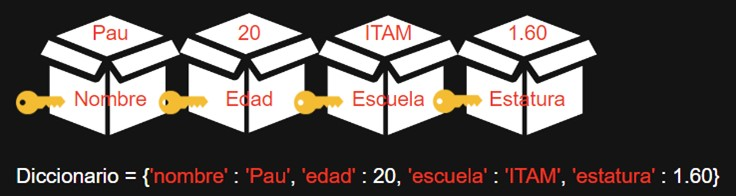

Antes de resolver el problema de Freddy, vamos a aprender sobre una estructura de datos esencial en Python: el diccionario.

## Objetivo:
Este problema nos introduce al uso de los diccionarios en Python, que funcionan como tablas de hash. Aquí, guardaremos los puntajes de los concursantes utilizando sus nombres como llaves. Es fundamental que cada nombre sea único y no se repita.

# Diccionarios en Python:

Un diccionario en Python es similar a un diccionario real: tienes una palabra (la llave) y su definición (el valor). Es una colección de pares llave-valor donde cada llave es única y está asociada a un valor. Los diccionarios son mutables, lo que significa que puedes cambiar, agregar o eliminar elementos después de que el diccionario ha sido creado.

Recordemos cómo se verían las *cajitas* de un arreglo:


Ahora veamos cómo se vería un diccionario:


**Observación:** Seguimos teniendo una estructura ordenada, la única diferencia es que en vez de tener números como índices, ahora tenemos llaves únicas que pueden ser definidas por el programador.

¿Cómo funciona esto en la práctica? Imagina que tienes que almacenar los nombres de algunos estudiantes y sus correspondientes calificaciones. Podrías tener algo así:

```python
estudiantes = {
    'Pau': 85,
    'Juan': 92,
    'Ana': 88
}
```

Si quieres encontrar la calificación de 'Pau', simplemente haces `estudiantes['Pau']`.

La sintaxis para trabajar con diccionarios en Python es directa y flexible. Aquí te muestro cómo se declara un diccionario, cómo se agregan nuevas llaves (o llaves), y cómo se puede modificar o acceder a sus elementos.

### Declaración de un Diccionario

Para declarar un diccionario vacío, se utilizan llaves `{}`:
```python
mi_diccionario = {}
```
También puedes iniciar un diccionario con pares llave-valor predefinidos:
```python
mi_diccionario = {'nombre': 'Pau', 'edad': 20, 'escuela': 'ITAM', 'estatura': 1.60}
```
### Agregar y Modificar Elementos
Para agregar una nueva llave-valor o modificar una existente, asigna un valor a una llave de la siguiente manera:
```python
mi_diccionario['nueva_llave'] = 'nuevo_valor'
```
Si la llave ya existe, el valor se actualizará. Si no existe, se agregará un nuevo par llave-valor al diccionario.

### Acceso a Elementos

Para acceder a un valor, usa la llave entre corchetes:

```python
valor = mi_diccionario['nombre']
```

Si intentas acceder a una llave que no existe, obtendrás un error `KeyError`. Para evitar esto, puedes usar el método `.get()`, que devuelve `None` o un valor predeterminado si la llave no existe:

```python
valor = mi_diccionario.get('nombre')
valor_inexistente = mi_diccionario.get('inexistente', 'Valor por defecto')
```

### Eliminar Elementos

Para eliminar un par llave-valor, puedes usar la palabra llave `del`:

```python
del mi_diccionario['nueva_llave']
```

O el método `.pop()`, que además te permite obtener el valor eliminado:

```python
valor_eliminado = mi_diccionario.pop('nueva_llave')
```

### Recorrer un Diccionario

Puedes recorrer un diccionario utilizando un bucle `for` para acceder a sus llaves y valores:

```python
for llave in mi_diccionario:
    print(llave, mi_diccionario[llave])
```

O puedes acceder a las llaves y valores directamente usando los métodos `.items()`:

```python
for llave, valor in mi_diccionario.items():
    print(llave, valor)
```

### Comprobación de Existencia

Para verificar si una llave está en el diccionario, puedes usar el operador `in`:

```python
if 'nombre' in mi_diccionario:
    print("La clave 'nombre' existe en el diccionario.")
```

Este operador devuelve `True` si la clave se encuentra en el diccionario y `False` de lo contrario.

### Tamaño de un Diccionario

Para obtener cuántos pares clave-valor hay en un diccionario, utiliza la función `len()`:

```python
numero_de_elementos = len(mi_diccionario)
print(f"El diccionario tiene {numero_de_elementos} elementos.")
```

### Diccionarios Anidados

Los diccionarios pueden contener otros diccionarios, lo que te permite crear estructuras de datos complejas:

```python
mi_diccionario = {
    'nombre': 'Pau',
    'estudios': {
        'escuela': 'ITAM',
        'grado': 'Licenciatura'
    },
    'estatura': 1.60
}
```

Para acceder a elementos en un diccionario anidado, simplemente encadena los corchetes:

```python
escuela = mi_diccionario['estudios']['escuela']
```
### Métodos Útiles

Algunos métodos útiles en diccionarios incluyen:

- `.keys()`: Devuelve una vista de todas las claves en el diccionario.
- `.values()`: Devuelve una vista de todos los valores en el diccionario.
- `.clear()`: Elimina todos los elementos del diccionario.

Aquí te muestro cómo se utilizan estos métodos:

```python
# Obtener todas las claves
claves = mi_diccionario.keys()

# Obtener todos los valores
valores = mi_diccionario.values()

# Limpiar el diccionario
mi_diccionario.clear()
```
Los diccionarios son herramientas poderosas y flexibles en Python que te permiten estructurar tus datos de manera eficiente y con un acceso rápido a la información a través de claves únicas.

## Problema:

Durante el Coding Rush, cada participante acumuló puntos. Los participantes están ansiosos por conocer su total de puntos para presumirlos. Freddy, el organizador, está demasiado ocupado, así que necesita un programa que le facilite esta tarea.

## Entrada:

- Primera Línea: `M`, el número de concursantes.
- Siguientes `M` líneas: `N_i`, el nombre del concursante `i-ésimo`, seguido de `P_i`, los puntos del concursante `i-ésimo`.
- Siguiente línea: El nombre del concursante cuyos puntos queremos buscar.

## Salida:

- El puntaje del concursante especificado.

## Explicación de la solución:

Para resolver este problema, vamos a utilizar un diccionario donde las llaves serán los nombres de los concursantes y los valores serán sus puntos acumulados.

Primero, debemos pedir al usuario que nos diga cuántos concursantes hay y preparar nuestro diccionario:

```python
n = int(input())
listaPuntos = {}
```

Luego, por cada concursante, guardaremos sus puntos en el diccionario:

```python
for i in range (n ):
    nombre = input ()
    puntos = int ( input () )
    listaPuntos [ nombre ] = puntos
```
Ahora, necesitamos saber el nombre del concursante cuyos puntos queremos buscar. Esto se hará a través de una entrada del usuario:

```python
nombre_a_buscar = input()
```

Con el nombre proporcionado, podemos acceder directamente al valor asociado en el diccionario, que son los puntos del concursante:

```python
print(listaPuntos[nombre_a_buscar])
```

Al ejecutar el comando `print(listaPuntos[nombre_a_buscar])`, el programa buscará en el diccionario `listaPuntos` la llave que coincide con `nombre_a_buscar` y nos devolverá el valor asociado, que en este caso son los puntos del concursante.

Y así, hemos utilizado los diccionarios para crear una solución simple y eficiente al problema de Freddy. ¿Ves cómo los diccionarios pueden ser herramientas poderosas para asociar pares de información y acceder a ellos de manera rápida?

Ahora, piensa en esto: ¿Qué pasaría si intentamos buscar un nombre que no existe en el diccionario? ¿Cómo podríamos manejar ese posible error? Reflexiona sobre cómo podrías expandir el código para hacerlo más robusto y seguro ante entradas inesperadas.